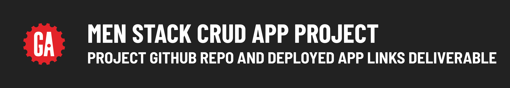

# 

## Contents

**Deliverable details**:

- GitHub repo deliverable
- Deployed app link deliverable

**Submitting deliverables**:

- Submitting your deliverables

## GitHub repo deliverable

After your project proposal has been approved, you'll need to set up a GitHub repo for your project.

> 🚨 As a reminder, you should use the same repo or keep all the repos you use for the entire duration of your project to meet the project requirements.

## Deployed app deliverable

During project week, you'll deploy your project so that others are able to use it on the internet! Follow the [MEN Stack Deployment guide](https://pages.git.generalassemb.ly/modular-curriculum-all-courses/universal-resources/deployment/men-stack-deployment/) to deploy your project.

## Submitting your deliverables

Follow the guidelines below to submit your deliverables for this project.

### Submitting your GitHub repo link

Submit a link to the ***public*** GitHub repo that you are using for your MEN Stack CRUD App Project below in the following format:

```plaintext
GitHub repo link: <link>
```

Replacing `<link>` (including the `<` and `>`) with a link to your GitHub repo.

### Submitting your deployed app link

Deploy your project by following the guide above. Submit a link to your deployed app in the following format:

```plaintext
Deployed project link: <link>
```

Replacing `<link>` (including the `<` and `>`) with a link to your deployed app.
