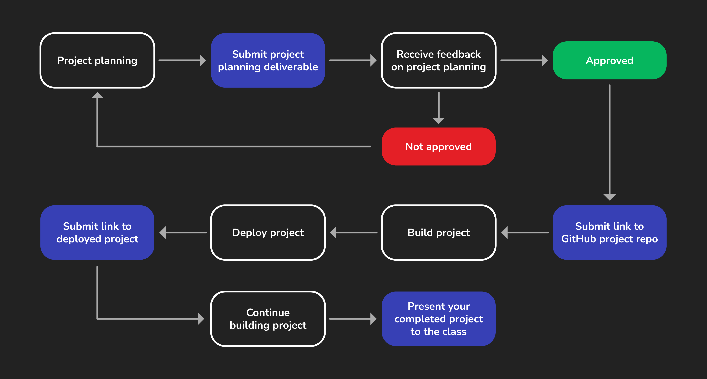

# 

Project week is when students typically learn the most. During this week you'll have fewer lectures and deliverables that are not related to your project. Instead, you'll primarily be self-directed to plan, build, and complete your project.

You'll need to submit some key deliverables along the way to keep you on track. Finally, at the end of project week you'll present your completed project to the class.

To help you through this process, we've included this guide to walk you through the individual steps outlined below (and shown above) so that you can be sure you're not missing anything along the way.

## Project info

Before you start planning, review the [project requirements](../project-requirements/README.md) to understand what features you must implement in your project. Then, review the [project details](../project-details/README.md), which includes helpful tips to get started.

## 1. Project planning

Project week starts with project planning. For more details and the specific requirements, see the [MEN Stack CRUD App Project Deliverables](../project-deliverables/README.md).

When you submit your project planning materials, your proposal will either be approved, or you'll receive feedback and be asked to make adjustments before a final approval can be given.

## 2. Create a GitHub repo

Once your project proposal is approved, create the public GitHub repo that you'll use for the project. See the [MEN Stack CRUD App Project Deliverables](../project-deliverables/README.md) for more details.

## 3. Build the project

The fun part! Start building your project!

## 4. Deploy the work you have so far

During project week, you'll deploy your project to the internet and submit a link to your deployed app. See the [MEN Stack CRUD App Project Deliverables](../project-deliverables/README.md) for more details.

Continue working on your project until presentation day.

## 5. Present your project

Project week ends with a presentation of your project!
