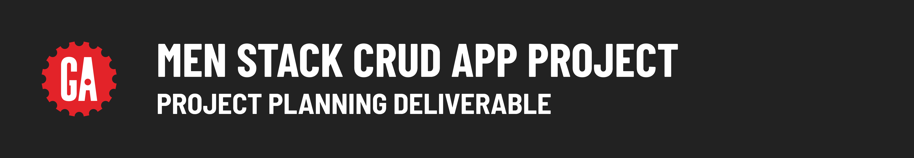

# 

## Introduction

Planning is vital to build anything more than the most trivial of applications; therefore, this is where you will begin your journey with this project. You shouldn't write any code or set up a GitHub repo for your project until an instructor approves your planning materials.

## Building your planning materials

Use [Trello](https://trello.com/) for your project planning work. This [video](https://www.youtube.com/watch?v=l3F3l3psqXY) has some helpful tips to get started using Trello if you've never used it before. Check out this [Trello support article](https://support.atlassian.com/trello/docs/changing-the-visibility-of-a-board/) to make your planning materials publicly available.

> 🚨 ***It is vital that you make your project planning publicly accessible; otherwise, no one can see it! Check out this [Trello support article](https://support.atlassian.com/trello/docs/changing-the-visibility-of-a-board/) to learn how!***

## Details

You will submit a public Trello board with these project planning details:

- MVP user stories, written in the following template: **As a [user role], I want [feature], so that [reason].** If the reason is obvious, it can be excluded.
- Wireframes for your app's main pages. For example, if you were building a blogging app, you might have wireframes for a landing page, the posts index page, and the add post page.
- An ERD for your app's data and the relationships between that data.

To organize this information, set up the Trello board for your project with the following **lists**:

- **MVP User Stories**: To hold your MVP user stories. Each user story should be an individual card in the list.
- **Wireframes**: To hold the wireframes for your app. Each wireframe should be an individual card on the list. You may also want to include Wireframes built with your stretch goals in mind. If you do this, ensure that these cards are clearly labeled.
- **ERD**: To hold the ERD for your project. You may want to include an ERD built with your stretch goals in mind as well. If you do this, ensure it is clearly labeled on a separate card.

During planning, you may want to include additional user stories that describe stretch goal features that go beyond the project requirements. Ensure these are in a separate list called **Stretch Goal User Stories** on your Trello board.

An example of an acceptable Trello board submission is shown here:

## Using Trello during project week

Some students like to use Trello during project week to keep track of their work. While you're more than welcome to do this, it is not a project requirement, and the method you use to organize your work is ultimately up to you!

## Submitting your planning materials

Submit a link to your ***publicly visible*** Trello board below.
